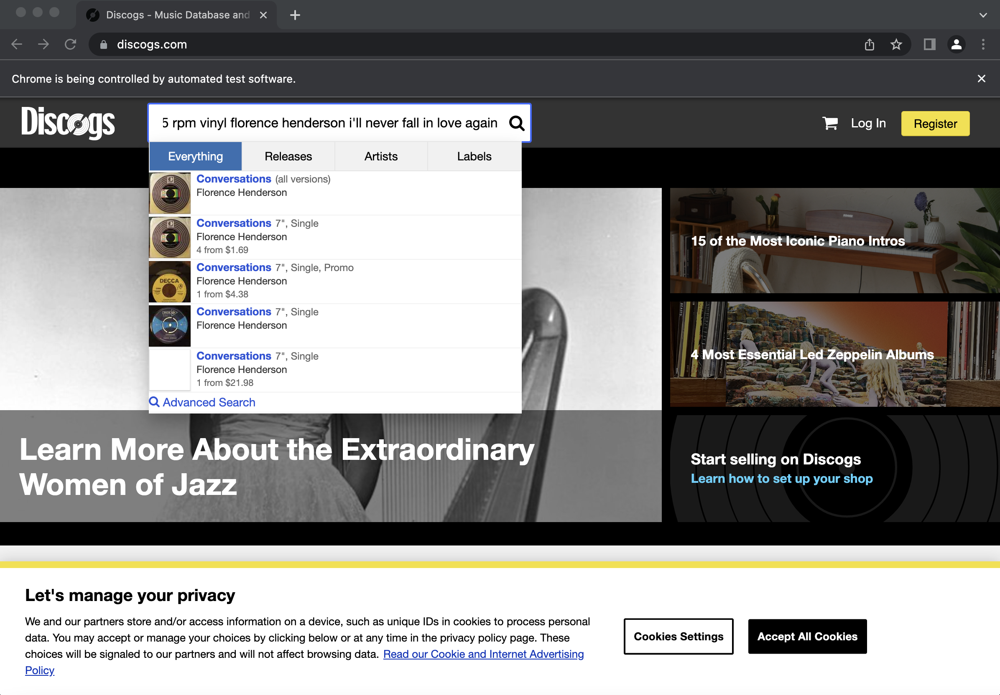
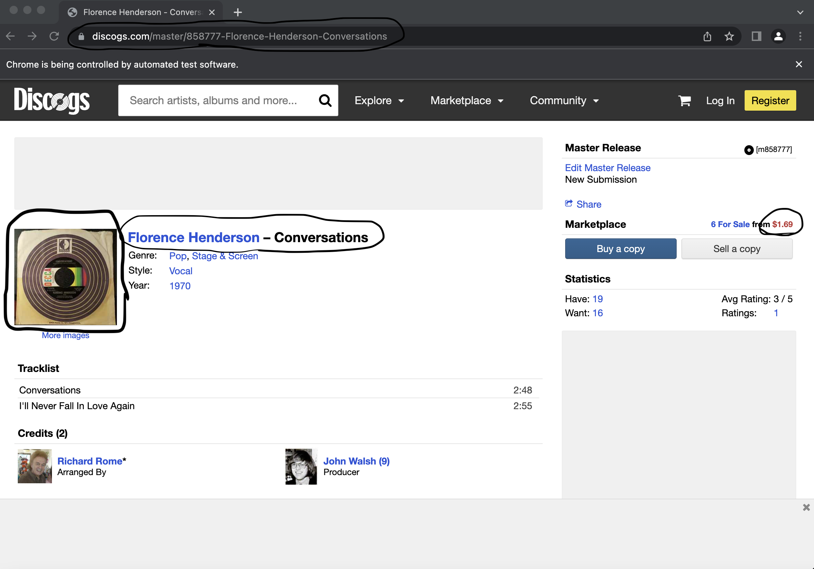

# selenium-vinyl-scanner 
Automated web scraper that uses Selenium to search up the titles of 45rpm vinyls and inserts information found into a csv file

## Quick Backstory
Over winter break I was helping my grandpa move an arcade machine from his "house of random stuff" and we came across a small box of
extremely old 45rpm vinyls. These vinyls are slightly different than the ones we are used to nowadays. Instead of an entire album on
the vinyl, each one had two songs. The A side typically had a more popular song and the B side had another song typically by the same
artist. A vinyl that had two popular songs on both the A and B side was more of a "hot commodity" and was seen as rare. 

When I first got the box of vinyls, I spent over 6 hours writing down the titles, looking up the prices, and inserting basic info into
an excel sheet. This was a lot of time spent looking up only about 100 vinyls. When I heard my grandpa found even more boxes of vinyls,
I was not mentally prepared to spend that amount of time searching up the prices for all those vinyls. So what did I do? I spent four 
times as long writing this program to do it for me :)

## Program Starting Information
This program requires a csv file with information in this order:

number(starting with 1), title1, title2, artist

- The file can also have a previously found price listed at the end in case you're interested in checking how accurate the program is
(the program has a function that compares the manually found price and program found price).
- The file also does not need to have a second title listed (just make sure to either leave a space or nothing before the comma).
- Can search up anything wanted on discogs, feel free to look up album vinyls, cds, or anything else (just edit part of the searching
algorithm as it adds '45 rpm vinyl' to the search for better results on the one title tracks).

## Files
### main.py
This is the main file with the main selenium webscraping loop. 
functions:
- main: main loop that keeps program running even with error crashes
- selenium_loop: loops through vinyls and searches them up using selenium
- no_price_writer: selenium_loop calls this function if a vinyl has no price listed
- last_resort_writer: selenium_loop calls this function if no information is found on a vinyl
- check_unknowns: double checks all the vinyls that were not found in original loop
- write_to_csv: writes vinyl information to new csv file (final product)

### csv_reader.py
This reads information from given csv file into a dictionary that can be accessed by main.py
info:
- needs to be imported by main function
- has no functions
- contains array of dictionaries

### compare_price.py
This is an optional python file that compares the prices of vinyls that were found manually
functions:
- compare_prices: compares two prices and prints out if it needs checked if the price difference is greater than 25%
- check_single_titles: prints out all the titles that were not found and listed as 'UNKNOWN' in the text file
- main: control function of the two other functions

### Testing files
These are the .txt and .csv files used for testing on my end
files:
- original-small-list-vinyls-example.csv: csv file with a list of six 45 rpm vinyls for csv_reader.py to read
- small-list-vinyls-example.txt: text file created during runtime with basic info on the six vinyls
- completed-small-list-vinyls-example.csv: csv file created after program is run to completion with updated info
- original-large-list-vinyls-example.csv: csv file with a list of 380 45 rpm vinyls for csv_reader.py to read
- large-list-vinyls-example.txt: text file created during runtime with basic info on the 380 vinyls
- completed-large-list-vinyls-example.csv: csv file created after program is run to completion with updated info

## Program During Runtime
### Visual Process
The program enters the titles into the discogs search bar (title1 / title2 artist) and selects the first option in the dropdown

The program relocates to the page of the selected track and grabs the webpage url, vinyl price, webpage url, and photo of the vinyl

The program the clicks on the Discogs logo in the top left to relocate back to the main page and begins process all over again with 
the next vinyl

### Code Theory and Errors
Selenium on discogs.com was prone to A LOT of errors. Some of the main issues I ran into was Selenium randomly not recognizing the dropdown
list and returning an index error, the searching page randomly freezing, StaleElementException, ElementNotINteractableException, and the 
biggest one, NoSuchElementException. To deal with most of these, I put the main part of the program into a loop and whenever an error 
occured, the program would shut down itself, restart, and research the previous item. This fixed many of the random minor bugs that would
happen with Selenium.

The main bug was the NoSuchElementException. This occured whenever nothing popped up in the search bar (this could happen randomly or because
the vinyl was so old no one was selling it on the site) or whenever a vinyl had no price listed. To deal with these, I made separate functions
to insert 'UNKNOWN' into the spots that were not found whenever a NoSuchElementException occured. I then created another function to double
check each vinyl that had an 'UNKNOWN' value listed. 

### Comparing Prices
In order to check to see if the prices being grabbed were correct, I created function that would compare two prices of the same vinyl. The 
program printed out results that "Needed Checked" if the difference between the two prices was greater than a ceratin percentage. Of course
this was only useful if the user had already searched up the prices beforehand. In order to check the others, I then added on to the function
to also print all the titles that were unknown. After this was done, the program printed out a percentage of the total vinyls that needed 
manually checked. 

### Writing Information to New CSV File
Once the program is completely done searching through all the vinyl titles, it then uses a dictionary to add the proper information into a
new csv file all at once. Throughout the program, whenever information was grabbed, it was added to a dictionary. This allowed for easy access
whenever needed throughout the useful. The function used to write to the csv file uses this dictionary to quickly and efficiently grab 
information about each vinyl and write it into the final version of the csv file

## Future Additions
One major issue left in the program is that Selenium will freeze on the main page and not do anything. This makes me have to manually re-run
the program (happens usually once every 200 vinyl titles). I want to make the program do this for me by re-running the page if it becomes
static or stuck on the same webpage for a certain amount of time. 

During the running of the program, I also grab the photos of each vinyl listed on the page. I am not sure what I want to do with this yet.
I am thinking about making a website with all the vinyls I have, which the pictures could be useful for. I don't really know yet though.

During the compare process, I have the programming printing out ones I manually need to check. This is annoying to read through and I never
actually check them because I am lazy. I want to make the program highlight the line in the actual csv file so instead of having to read what
is wrong, I can directly see which ones to just forget about because I am still lazy and still won't bother looking them up.

Another weird issue is the program accidentally clicking on a completely different vinyl and recording that info. Sometimes it would click 
on the album version of the vinyl or for example Johnny Cash (I have no Johnny Cash vinyls). I can't tell when it does this unless I watched
it do it. This is why I grabbed the webpage title from each vinyl. I want to make a new comparison that compares the title of the webpage to
the artist and titles that were originally searched

## Final Conclusion
I learned about webscraping, automation, csv files in python, handling errors properly, and Selenium in this project. This project also 
helped me get closer to my grandpa as we frequently talked about how the project was going, what vinyls he had were worth a lot, and any
new vinyls he had found or was looking for. 

There was a lot of weird bugs found during this which leads to a lot of double checking and verification. There are still a lot of things
left that need to be fixed, but overall if most of the information about a vinyl is given, this program can search up a vinyl and give you
information about it in the form of a csv file. 
